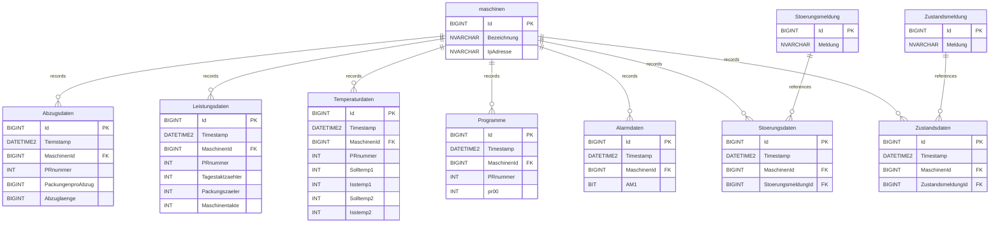

# Maschinendaten – Digitalization of Production Processes

🌐 **Language:** [Deutsch](README.md) | English

> Master's thesis *"Analysis Techniques for Increasing the Operational Efficiency of Packaging Machines"*, in cooperation with **Rostocker Wurst- und Schinkenspezialitäten GmbH**
> University of Rostock, Faculty of Computer Science and Electrical Engineering (IEF), Master ITTI program

## About the project

This repository contains the database foundation of a system for the **digitalization and optimization of production processes** through machine data acquisition, in the spirit of **Industry 4.0**. The Rostock plant uses **VARIOVAC** packaging machines (including *Primus* and *Multipower* models) with **Siemens S7 controllers**. The machines deliver process, state, alarm, and performance data via the **OPC DA protocol** (COM/DCOM-based, RFC1006), which is read out using **Softing dataFEED OPC Suite** and written to a central SQL database via an **ODBC interface** — an architecture that conceptually corresponds to a classic **SCADA** connection. This provides the data basis for typical **MES** functions (production and machine data acquisition, fault tracking) as well as for deriving metrics such as **OEE (Overall Equipment Effectiveness)**. Migrating to the more modern, platform-independent **OPC UA** protocol is recommended as a sensible next step in the underlying thesis (see [Recommendations](#recommendations--outlook)).

## Goals

- **Replacing manual, paper-based logging** with automated machine data acquisition — the core function of an MES.
- **Uniform, standardized data transfer via the OPC DA protocol**, in a form comparable to what is common in SCADA systems; a later migration to OPC UA is planned.
- **Persistent, structured storage of all relevant machine, state, alarm, and performance data.** When a technician selects a machine in the web interface, the corresponding current alarm messages and any other faults that have occurred are displayed immediately — providing a basis for fast fault diagnosis.
- **Calculating the performance of all machines from the package counter** (daily cycle counter, machine cycles) as a reliable data basis for production planning — one of the project's central goals.
- **Foundation for data analysis and visualization**, including **OEE** calculation, downtime analysis, and temperature monitoring.
- **Contribution to networked production in the spirit of Industry 4.0.**

## Tech stack

| Area | Technology |
|---|---|
| Backend | .NET (C#, ASP.NET Core MVC) |
| Data acquisition | Softing dataFEED OPC Suite (OPC DA), ODBC |
| Data visualization | Chart.js, Highcharts |
| Data storage | SQL Server (database project, SSDT), Entity Framework Core |

## Project structure

```
Maschinendaten.slnx              # Visual Studio solution
└── Maschinendaten/               # SQL Server database project (.sqlproj)
    ├── maschinen.sql             # Machine master data
    ├── Abzugsdaten.sql           # Draw/packaging data
    ├── Leistungsdaten.sql        # Cycle and performance metrics
    ├── Temperaturdaten.sql       # Target/actual temperatures
    ├── Programme.sql             # Program parameters (pr00–pr09)
    ├── Alarmdaten.sql            # Alarm states (bit fields AM1–AM94)
    ├── Alarmmeldungen.sql        # Plain-text alarm messages
    ├── Stoerungsdaten.sql        # Fault events per machine
    ├── Stoerungsmeldung.sql      # Plain-text fault messages
    ├── Zustandsdaten.sql         # State changes per machine
    └── Zustandsmeldung.sql       # Plain-text state messages
```

The database project is a **SQL Server Database Project (SSDT)** and can be opened directly in Visual Studio via `Maschinendaten.slnx` and published to a SQL Server instance.

## Data model

The central reference point of all tables is `maschinen`, which every measurement table references via `MaschinenId`. Plain-text messages (alarms, faults, states) are stored in their own lookup tables.



### Table overview

| Table | Purpose |
|---|---|
| `maschinen` | Master data per machine (name, IP address for OPC connection) |
| `Abzugsdaten` | Draw length and packages per draw, per machine/program |
| `Leistungsdaten` | Cycle counters, package counters, and machine cycles for performance tracking |
| `Temperaturdaten` | Target/actual temperatures for two measuring points |
| `Programme` | Active program parameters (`pr00`–`pr09`) per program number |
| `Alarmdaten` | Snapshot of up to 94 alarm indicators (`AM1`–`AM94`) as bit fields |
| `Alarmmeldungen` | Plain-text translation of alarm indicator codes |
| `Stoerungsdaten` | Timestamp and reference to a fault that occurred, per machine |
| `Stoerungsmeldung` | Plain-text fault messages |
| `Zustandsdaten` | Timestamp and reference to a machine state |
| `Zustandsmeldung` | Plain-text state messages |

## Origin of the machine data

The recorded values come directly from the memory of the Siemens S7 controller of the VARIOVAC machines and are addressed as OPC tags via fixed data block addresses (DB addresses), e.g.:

| OPC tag | PLC address | Unit | Description |
|---|---|---|---|
| `OPC_Daten/T_SOLL2` | `DB85.DBW30:INT` | °C (1/10) | Target temperature, control loop 2, mold upper part |
| `OPC_Daten/Isttemp_FWZ_Ob1` | `DB85.DBW494:INT` | °C (1/10) | Actual temperature, upper heating unit of the mold |
| `OPC_Daten/T_SOLL4` | `DB85.DBW34:INT` | °C (1/10) | Target temperature, control loop 4, sealing tool |
| `OPC_Daten/Isttemp_SWZ` | `DB85.DBW490:INT` | °C (1/10) | Actual temperature, sealing tool |

**Scaling:** Temperature and length values are stored in the PLC as integers (`INT`) in a 1/10 format — a raw value of `432` corresponds to `43.2 °C`, for example. Binary alarm and state indicators are transmitted as `BOOL` (0/1). This scaling is applied when the data is written to the database.

State and fault messages (`Zustandsmeldung`, `Stoerungsmeldung`) are plain-text translations of numeric codes provided by the controller at defined byte addresses (e.g. `DB85.DBB530:BYTE` for state messages, `DB85.DBB453:BYTE` for fault messages), catalogued based on the VARIOVAC manufacturer documentation.

## Data flow

```
VARIOVAC packaging machine (Siemens S7)
      │  OPC DA protocol (COM/DCOM, RFC1006)
      ▼
Softing dataFEED OPC Suite  (OPC DA server)
      │  ODBC driver (32-bit)
      ▼
SQL Server database
      │  Entity Framework Core
      ▼
ASP.NET Core MVC web application
      │  Chart.js / Highcharts
      ▼
Browser-based live overview & analysis
```

Data is transferred from the machine to the database by configuring an "SQL database" data destination in the Softing dataFEED OPC Suite: each OPC tag is mapped to a database field there, and the transfer is triggered on a schedule via `INSERT INTO` statements.

## Requirements

- SQL Server (local or a network instance)
- Visual Studio with SQL Server Data Tools (SSDT) to open `Maschinendaten.slnx`
- .NET SDK for the web application
- Softing dataFEED OPC Suite to configure the OPC DA connection

## Installation & setup

1. Clone the repository
2. Open `Maschinendaten.slnx` in Visual Studio
3. Publish the database project to the target SQL Server instance (right-click → *Publish*)
4. Configure the OPC server connection details and the database connection string in the .NET application
5. Start the .NET application to activate data acquisition

## Live application / demo

The web interface for the live evaluation of machine data is available at:

🔗 **[https://maschinen.onrender.com](https://maschinen.onrender.com/)**

The application (ASP.NET Core) reads the machine data stored in the SQL database and displays it continuously updated across several views. The home page ("Current overview") shows the latest records for each table live.

### Available views

| View | Route | Content |
|---|---|---|
| Current overview | `/` | Summary of all data areas on one page |
| Performance | `/LeistungsDaten` | Cycle counters, packages, and machine cycles per machine/program |
| Draw | `/Abzugsdaten` | Draw length and packages per draw, per machine/program |
| Temperature | `/TemperaturDaten` | Target/actual temperatures of lower and upper film |
| Alarm | `/AlarmDaten` | Active alarm indicators per machine |
| State | `/ZustandsDaten` | Current and historical machine states |
| Fault | `/StoerungsDaten` | Faults that occurred per machine |
| Frequent messages | `/Haeufigkeit` | Analysis of the most frequently occurring alarm/fault messages |
| Planning | `/Planung` | Production planning/overview view |

### Sample excerpt (live data)

**Performance data**

| Timestamp | Machine | Program | Daily cnt. | Cycles | Packages | Cycle bar |
|---|---|---|---|---|---|---|
| 19.02.2025 16:27:38 | Maschine-01 | 1KG VAC | 83 | 2,650,759 | 332 | 100% |

**Draw data**

| Timestamp | Machine | Program name | Packages per draw | Draw length |
|---|---|---|---|---|
| 19.02.2025 15:50:11 | Maschine-01 | 1KG VAC | 9 pcs | 400 mm |
| 19.02.2025 15:50:11 | Maschine-02 | SCHRAEGSCH | 9 pcs | 420 mm |

**Temperature data**

Shows target/actual temperatures for lower film (`Isstemp1`) and upper film (`Isstemp2`) per machine and program, including timestamp.

The page also offers a **Reload** function to manually refresh the live view.

> These views directly reflect the content of the database tables described above (`Leistungsdaten`, `Abzugsdaten`, `Temperaturdaten`, `Alarmdaten`, `Zustandsdaten`, `Stoerungsdaten`), confirming that the full pipeline machine → OPC → .NET → SQL Server → web interface is already in productive use.

## Software architecture

The ASP.NET Core MVC application consistently follows the MVC pattern with a clear separation of controllers, data models, and view models:

- **Controllers** (one per data area, e.g. `AbzugsDatenController`, `AlarmDatenController`, `LeistungsDatenController`, `StoerungsDatenController`, `ZustandsDatenController`, `ProgrammenController`) read filter settings from cookies, filter data by time range and machine ID, and pass it to the view layer. A `TableSelectionController` handles routing between the table views.
- **`MaschinenDbContext`** (Entity Framework Core) defines all tables as `DbSet<T>` and sets the primary keys in `OnModelCreating`.
- **View model layer** (including `AbzugsdatenModelView`, `DashboardModelView`, `LeistungsdatenModelView`, `TemperaturdatenModelView`, `HaeufigkeitModelView`) prepares the raw data for display, e.g. combining program name and measured values, and feeds the dashboard.
- **`PaginatedList<T>`** implements generic server-side pagination for all data tables in the application.
- The `Programmen` class automatically converts the numeric fields `pr00`–`pr09` into a readable program name via ASCII conversion (e.g. "1KG VAC").

## Analysis methods for fault detection

Based on the recorded temperature data, several analysis methods were investigated as part of the thesis to assess operational stability and detect faults:

- **Piecewise regression / piecewise polynomial regression**: segmenting the temperature curve into characteristic process phases (heating, holding, cooling), each with a separate quadratic regression model.
- **10th-degree polynomial regression**: global modeling of the temperature curve as a comparison baseline for the piecewise regression.
- **Error probability model**: estimating the daily fault probability based on several independent influencing factors — temperature deviation, program changes, product sensitivity, draw speed, and the particularly fault-prone shift start-up phase (first 15 minutes).
- **Fault flow diagram**: a structured decision tree for distinguishing between user and equipment faults in the event of temperature deviations, and for verifying that a fault has been resolved.
- **Exploratory charts**: line chart, histogram, boxplot, and bar chart of temperature deviations per sensor to identify outliers, spread, and recurring patterns.

## Recommendations & outlook

The thesis yields the following recommendations for further development of the system:

1. **Operator training** on correctly matching tool, film, and program number to avoid operating errors.
2. **Locking changes during active production** (program switches, target temperature adjustments) to prevent unwanted temperature deviations.
3. **Displaying the temperature deviation on the operator panel**, including program-specific documented tolerance ranges.
4. **Migrating from OPC DA to OPC UA** to achieve platform independence, higher security (encryption, certificates), and easier cloud connectivity (e.g. Siemens MindSphere, AWS IoT, Azure IoT Hub).

## Related master's thesis

This repository forms the technical foundation of the following master's thesis:

> Bikineh, M. (2025). *Analysetechniken zur Steigerung der Betriebseffizienz von Verpackungsmaschinen* [Analysis techniques for increasing the operational efficiency of packaging machines]. Master's thesis, University of Rostock, Faculty of Computer Science and Electrical Engineering (IEF), Master ITTI program.


## Status

The core components — the database schema, OPC DA data acquisition via the Softing dataFEED OPC Suite, and the ASP.NET Core MVC web application for live evaluation — are already in productive use (see [Live application](#live-application--demo)). The analysis methods developed as part of the thesis (regression models, error probability model) exist as standalone evaluations; integrating them as permanent parts of the web interface, as well as migrating to OPC UA, are planned as next steps.

## Author

Master's thesis by Mohammadhossein Bikineh (Master ITTI, University of Rostock), in cooperation with Rostocker Wurst- und Schinkenspezialitäten GmbH.


