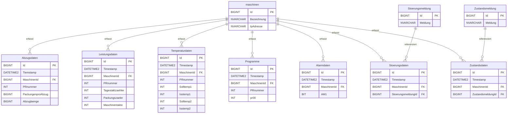

# Maschinendaten – Digitalisierung von Produktionsprozessen

> Masterarbeit im Rahmen der Zusammenarbeit mit der **Rostocker Wurst- und Schinkenspezialitäten GmbH**

## Über das Projekt

Dieses Repository enthält die Datenbankgrundlage eines Systems zur **Digitalisierung und Optimierung von Produktionsprozessen** mittels Maschinendatenerfassung. Produktionsmaschinen werden über **Softing OPC-Programme** angebunden und liefern standardisiert über das **OPC UA/DA-Protokoll** Prozess-, Zustands-, Alarm- und Leistungsdaten, die in einer zentralen SQL-Datenbank gespeichert werden. Auf dieser Datenbasis sollen anschließend effiziente Verfahren zur Datenanalyse und -visualisierung umgesetzt werden.

## Ziele

- Ablösung manueller/papierbasierter Erfassung durch automatisierte Maschinendatenerfassung
- Einheitliche, standardisierte Datenübertragung über OPC UA/DA
- Persistente, strukturierte Speicherung aller relevanten Maschinen-, Zustands-, Alarm- und Leistungsdaten
- Grundlage für Datenanalyse und -visualisierung (z. B. OEE-Kennzahlen, Stillstandsanalysen, Temperaturüberwachung)

## Technologiestack

| Bereich | Technologie |
|---|---|
| Backend | .NET (C#, ASP.NET Core) |
| Datenanbindung | Softing OPC UA/DA |
| Datenanalyse | Python |
| Datenhaltung | SQL Server (Datenbankprojekt, SSDT) |

## Projektstruktur

```
Maschinendaten.slnx              # Visual-Studio-Solution
└── Maschinendaten/               # SQL-Server-Datenbankprojekt (.sqlproj)
    ├── maschinen.sql             # Stammdaten der Maschinen
    ├── Abzugsdaten.sql           # Abzugs-/Verpackungsdaten
    ├── Leistungsdaten.sql        # Takt- und Leistungskennzahlen
    ├── Temperaturdaten.sql       # Soll-/Ist-Temperaturen
    ├── Programme.sql             # Programmparameter (pr00–pr09)
    ├── Alarmdaten.sql            # Alarmzustände (Bitfelder AM1–AM94)
    ├── Alarmmeldungen.sql        # Klartext-Alarmmeldungen
    ├── Stoerungsdaten.sql        # Störungsereignisse je Maschine
    ├── Stoerungsmeldung.sql      # Klartext-Störungsmeldungen
    ├── Zustandsdaten.sql         # Zustandswechsel je Maschine
    └── Zustandsmeldung.sql       # Klartext-Zustandsmeldungen
```

Das Datenbankprojekt liegt als **SQL Server Database Project (SSDT)** vor und kann direkt in Visual Studio über `Maschinendaten.slnx` geöffnet und gegen eine SQL-Server-Instanz veröffentlicht werden.

## Datenmodell

Zentraler Bezugspunkt aller Tabellen ist `maschinen`, auf die alle Messwert-Tabellen per `MaschinenId` referenzieren. Klartext-Meldungen (Alarme, Störungen, Zustände) sind in eigenen Nachschlagetabellen ausgelagert.



### Tabellenübersicht

| Tabelle | Zweck |
|---|---|
| `maschinen` | Stammdaten je Maschine (Bezeichnung, IP-Adresse für OPC-Anbindung) |
| `Abzugsdaten` | Abzugslänge und Packungsanzahl pro Abzug je Maschine/Programm |
| `Leistungsdaten` | Taktzähler, Packungszähler und Maschinentakte zur Leistungsermittlung |
| `Temperaturdaten` | Soll-/Ist-Temperaturen zweier Messstellen |
| `Programme` | Aktive Programmparameter (`pr00`–`pr09`) je Programmnummer |
| `Alarmdaten` | Momentaufnahme von bis zu 94 Alarmmeldern (`AM1`–`AM94`) als Bitfelder |
| `Alarmmeldungen` | Klartext-Übersetzung der Alarmmelder-Codes |
| `Stoerungsdaten` | Zeitpunkt und Referenz auf eine aufgetretene Störung je Maschine |
| `Stoerungsmeldung` | Klartext-Störungsmeldungen |
| `Zustandsdaten` | Zeitpunkt und Referenz auf einen Maschinenzustand |
| `Zustandsmeldung` | Klartext-Zustandsmeldungen |

## Datenfluss

```
Produktionsmaschine
      │  (OPC UA/DA)
      ▼
Softing OPC-Programm
      │
      ▼
.NET-Anbindung (ASP.NET Core)
      │
      ▼
SQL-Server-Datenbank  ──►  Python-Analyse & Visualisierung
```

## Voraussetzungen

- SQL Server (lokal oder Instanz im Netzwerk)
- Visual Studio mit SQL Server Data Tools (SSDT) zum Öffnen von `Maschinendaten.slnx`
- .NET SDK für die Anbindungskomponente
- Python-Umgebung für Analyse/Visualisierung

## Installation & Setup

1. Repository klonen
2. `Maschinendaten.slnx` in Visual Studio öffnen
3. Datenbankprojekt gegen die Ziel-SQL-Server-Instanz veröffentlichen (Rechtsklick → *Publish*)
4. Verbindungsdaten der OPC-Server sowie die Datenbank-Connection-String in der .NET-Anwendung hinterlegen
5. .NET-Anwendung starten, um die Datenerfassung zu aktivieren

## Live-Anwendung / Demo

Die Weboberfläche zur Live-Auswertung der Maschinendaten ist unter folgender Adresse erreichbar:

🔗 **[https://maschinen.onrender.com](https://maschinen.onrender.com/)**

Die Anwendung (ASP.NET Core) liest die in der SQL-Datenbank gespeicherten Maschinendaten aus und stellt sie fortlaufend aktualisiert in mehreren Übersichten dar. Auf der Startseite ("Aktuelle Übersicht") werden die jeweils letzten Datensätze je Tabelle live angezeigt.

### Verfügbare Ansichten

| Ansicht | Route | Inhalt |
|---|---|---|
| Aktuelle Übersicht | `/` | Zusammenfassung aller Datenbereiche auf einer Seite |
| Leistung | `/LeistungsDaten` | Taktzähler, Packungen und Maschinentakte je Maschine/Programm |
| Abzug | `/Abzugsdaten` | Abzuglänge und Packungen pro Abzug je Maschine/Programm |
| Temperatur | `/TemperaturDaten` | Soll-/Ist-Temperaturen von Unter- und Oberfolie |
| Alarm | `/AlarmDaten` | Aktive Alarmmelder je Maschine |
| Zustand | `/ZustandsDaten` | Aktuelle und historische Maschinenzustände |
| Störung | `/StoerungsDaten` | Aufgetretene Störungen je Maschine |
| Häufige Meldungen | `/Haeufigkeit` | Auswertung der am häufigsten auftretenden Alarm-/Störungsmeldungen |
| Planung | `/Planung` | Produktionsplanungs-/-übersichtsansicht |

### Beispielhafter Ausschnitt (Live-Daten)

**Leistungsdaten**

| Zeitstempel | Maschine | Programm | Tagesz. | Takte | Packungen | Takte-Balken |
|---|---|---|---|---|---|---|
| 19.02.2025 16:27:38 | Maschine-01 | 1KG VAC | 83 | 2.650.759 | 332 | 100 % |

**Abzugsdaten**

| Zeitstempel | Maschine | PR-Name | Packungen pro Abzug | Abzuglänge |
|---|---|---|---|---|
| 19.02.2025 15:50:11 | Maschine-01 | 1KG VAC | 9 Stück | 400 mm |
| 19.02.2025 15:50:11 | Maschine-02 | SCHRAEGSCH | 9 Stück | 420 mm |

**Temperaturdaten**

Anzeige der Soll-/Ist-Temperaturen für Unterfolie (`Isstemp1`) und Oberfolie (`Isstemp2`) je Maschine und Programm, inkl. Zeitstempel.

Die Seite bietet zudem eine **Reload**-Funktion zum manuellen Aktualisieren der Live-Ansicht.

> Die Ansichten spiegeln direkt den Inhalt der oben beschriebenen Datenbanktabellen (`Leistungsdaten`, `Abzugsdaten`, `Temperaturdaten`, `Alarmdaten`, `Zustandsdaten`, `Stoerungsdaten`) wider und bestätigen, dass die Pipeline Maschine → OPC → .NET → SQL-Server → Weboberfläche bereits produktiv im Einsatz ist.

## Status

Die Kernkomponenten – Datenbankschema, OPC-Datenerfassung über die .NET-Anwendung sowie die Weboberfläche zur Live-Auswertung – sind bereits produktiv im Einsatz (siehe [Live-Anwendung](#live-anwendung--demo)). Im Rahmen der laufenden Masterarbeit folgen weiterführende Auswertungen und Visualisierungen (u. a. Python-basierte Analysen, OEE-Kennzahlen).

## Autor

Masterarbeit in Kooperation mit der Rostocker Wurst- und Schinkenspezialitäten GmbH.

## Lizenz

Noch nicht festgelegt.
